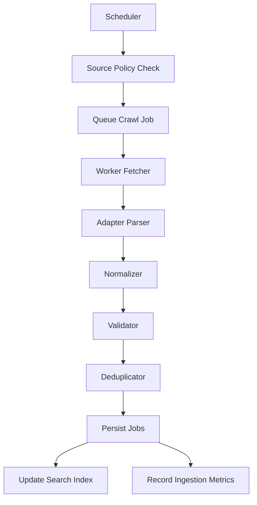

# Phase 4: Job Aggregation System

## Objective

Build a safe, observable, continuously running job aggregation system for India-first job discovery.

## Approved Baseline

- Continuous ingestion for all users
- Start with curated India company career pages and public ATS sources
- Use config-file source management first for faster launch
- Avoid direct LinkedIn scraping unless official permission/API access exists
- Use source freshness rules to hide stale jobs

## Source Priority

| Priority | Source | Policy |
| --- | --- | --- |
| P0 | Greenhouse | Allowed when public |
| P0 | Lever | Allowed when public |
| P0 | Ashby | Allowed when public |
| P0 | Company career pages | Allowed after source policy review |
| P1 | Public web job pages | Allowed after source policy review |
| P3 | LinkedIn | Permissioned/manual/outbound-safe only |

## Architecture

## Source Policy Rules

- Crawl only public pages.
- Do not bypass login walls, CAPTCHAs, or bot protection.
- Do not scrape candidate or recruiter personal data.
- Use allowlists and blocklists.
- Set per-source request limits.
- Track robots and terms review status.
- Pause sources after repeated failures.

## Stale Job Policy

For MVP:

- Update `last_seen_at` on every successful source refresh.
- Mark a job `REMOVED` when the source no longer lists it.
- Treat jobs older than 30 days without refresh as stale in ranking.
- Hide jobs after 45 days without refresh unless the source confirms they are still active.

## Retry Strategy

| Failure | Behavior |
| --- | --- |
| Timeout | Retry with exponential backoff |
| Rate limited | Cool down source |
| 500/503 | Retry later |
| Parser failure | Record error and continue |
| Login/CAPTCHA wall | Block source |
| Terms/robots blocked | Block source |

## Monitoring

Track jobs fetched, created, updated, expired, duplicates, parser failures, fetch failures, retry count, source latency, source freshness, and queue depth.

## Production Considerations

- Keep scraping in workers, never API requests.
- Run browser rendering only in a separate low-concurrency queue.
- Store raw snapshots selectively.
- Add a takedown workflow.
- Add admin dashboard after the first config-driven ingestion release.

## Approval Status

Approved.

