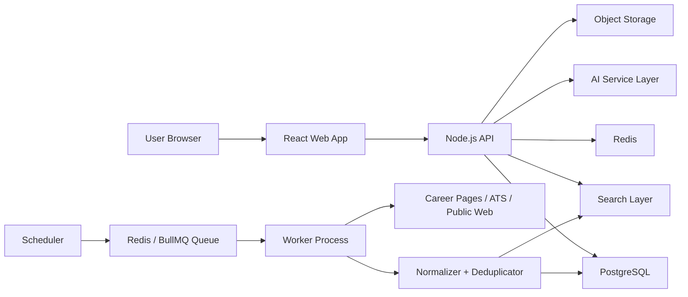
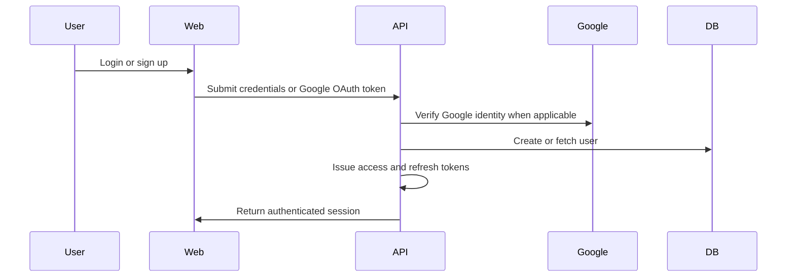
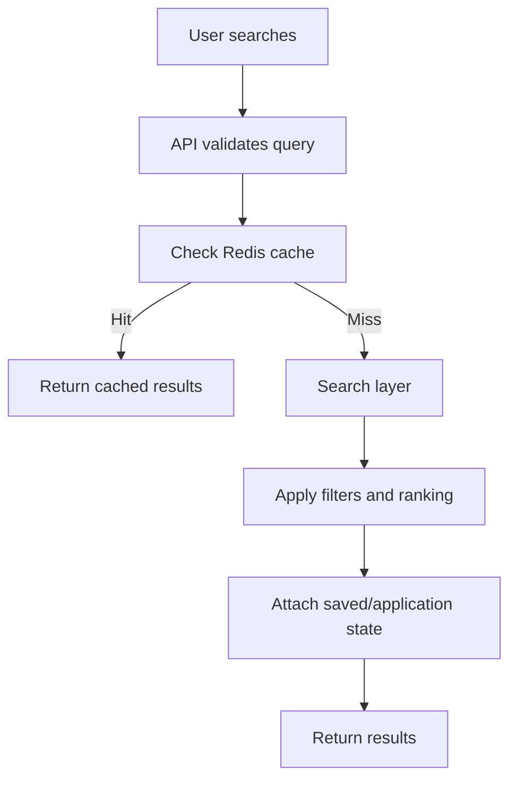
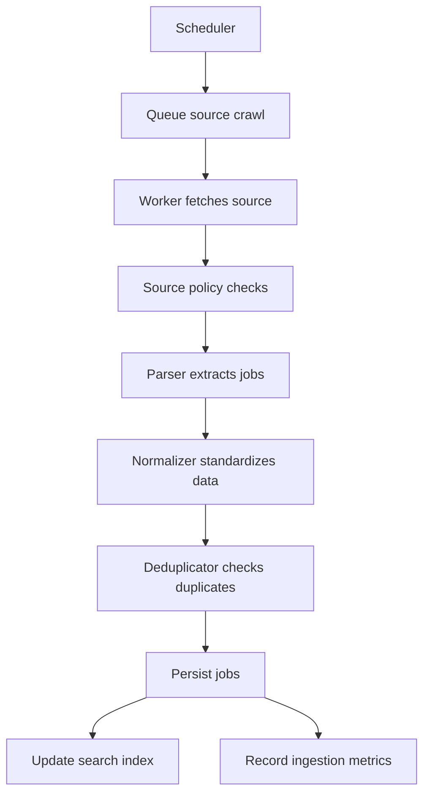
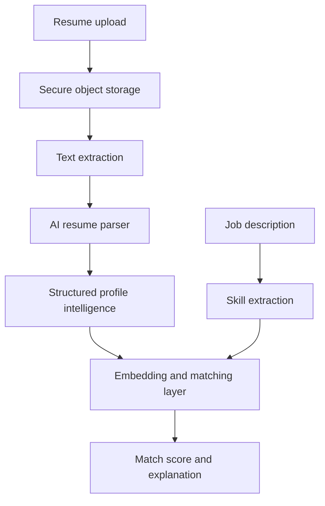

# Phase 2: System Design

## Objective

Design a scalable production architecture for a fast MVP that can later support millions of users, jobs, searches, resume uploads, AI workloads, and continuous job ingestion.

## Recommended Architecture

Use a modular monolith plus background workers.

## Why

- Faster MVP delivery than microservices
- Cleaner operational model
- Easier debugging and deployment
- Still supports strong module boundaries
- Allows future extraction of ingestion, search, and AI services

## Trade-Offs

| Architecture | Pros | Cons | Best Use |
| --- | --- | --- | --- |
| Modular monolith | Fast, simple, maintainable | Can grow large if boundaries are weak | MVP and early scale |
| Microservices | Independent scaling and ownership | High operational complexity | Later stage with clear scaling pain |
| Serverless-first | Low infrastructure management | Harder local development and long-running scraping | Specific async workloads later |

## High-Level Components

## Core Components

| Component | Responsibility |
| --- | --- |
| Web App | Candidate experience, search, resume upload, application tracking |
| API | Auth, profiles, jobs, resumes, saved jobs, applications, AI endpoints |
| Worker | Scraping, parsing, normalization, deduplication, AI jobs, indexing |
| Scheduler | Continuous source refresh |
| Queue | Retries, delays, background processing |
| PostgreSQL | Primary source of truth |
| Redis | Cache, rate limits, queue backend |
| Search Layer | Search abstraction for MVP and future scale |
| Object Storage | Secure resume file storage |
| AI Layer | Provider-agnostic resume analysis and matching |

## Authentication Flow

## Search Flow

## Job Aggregation Flow

## AI Flow

## Deployment Direction

- Dockerized API container
- Dockerized worker container
- Managed PostgreSQL
- Managed Redis
- S3-compatible object storage
- Static frontend hosting behind CDN
- Monitoring and logs from first production release

## Source Policy

The ingestion system must classify sources before crawling.

| Source | MVP Policy |
| --- | --- |
| Company career pages | Allowed when public and accessible |
| Greenhouse | Allowed |
| Lever | Allowed |
| Ashby | Allowed |
| Public web job pages | Allowed after policy checks |
| LinkedIn | Avoid direct automated scraping unless official permission/API access exists |

## Architecture Decision Records

See `docs/adr`.

## Approval Status

Approved.

