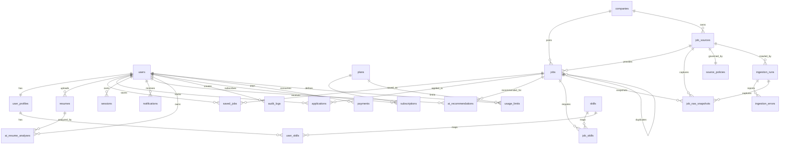

# Entity Relationship Diagram

```mermaid
erDiagram
  users ||--|| user_profiles : has
  users ||--o{ resumes : uploads
  users ||--o{ saved_jobs : saves
  users ||--o{ applications : tracks
  users ||--o{ sessions : owns
  users ||--o{ notifications : receives
  users ||--o{ ai_recommendations : receives
  users ||--o{ ai_resume_analyses : owns
  users ||--o{ audit_logs : creates
  users ||--o{ subscriptions : subscribes
  users ||--o{ payments : pays
  users ||--o{ usage_limits : consumes

  plans ||--o{ subscriptions : defines
  plans ||--o{ usage_limits : limits

  companies ||--o{ jobs : posts
  companies ||--o{ job_sources : owns
  job_sources ||--o{ jobs : provides
  job_sources ||--o{ job_raw_snapshots : captures
  job_sources ||--|| source_policies : governed_by
  job_sources ||--o{ ingestion_runs : crawled_by
  ingestion_runs ||--o{ ingestion_errors : reports
  ingestion_runs ||--o{ job_raw_snapshots : captures

  jobs ||--o{ saved_jobs : saved_as
  jobs ||--o{ applications : applied_to
  jobs ||--o{ ai_recommendations : recommended_for
  jobs ||--o{ job_skills : requires
  jobs ||--o{ job_raw_snapshots : snapshots
  jobs ||--o{ jobs : duplicates

  skills ||--o{ job_skills : maps
  skills ||--o{ user_skills : maps
  user_profiles ||--o{ user_skills : has
  resumes ||--o{ ai_resume_analyses : analyzed_by
```
